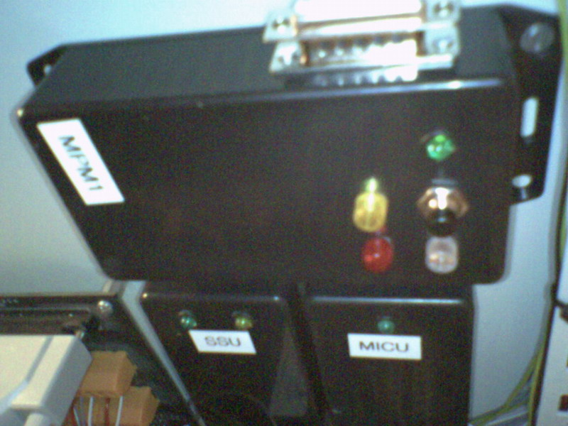

## Source code for project: [Multi-purpose AVR module](https://link.stdout.no/D)

Monitor Rack status panel, misc apartment sensors, turn off light relay. Uses an AVR ATtiny2313 microcontroller.

Written in basic, using [Bascom-AVR](http://www.mcselec.com/).

### Author
[Thomas Jensen](https://thomas.stdout.no)
